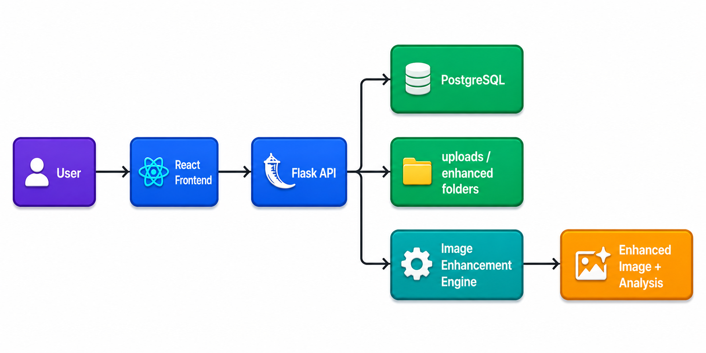
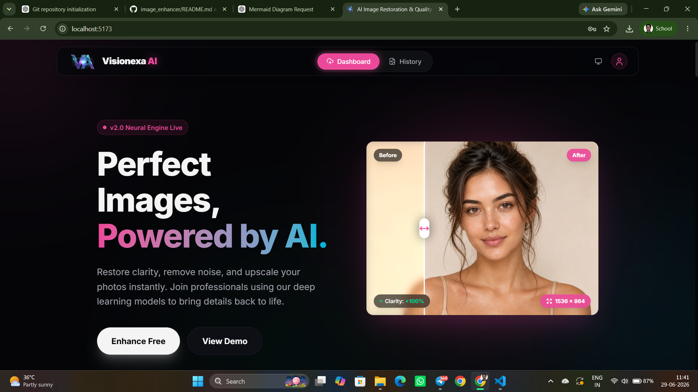
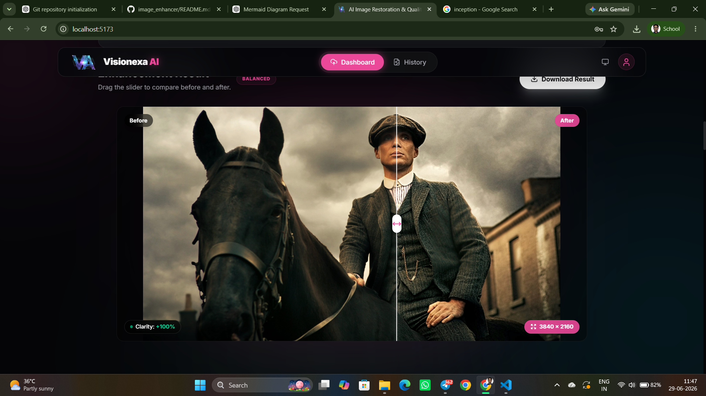
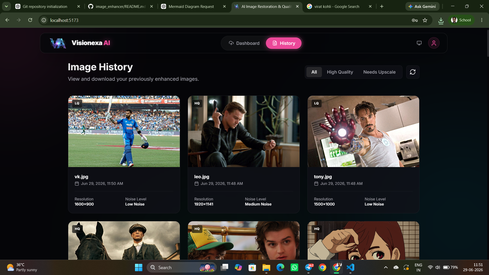

# Image Enhancer

Image Enhancer is a full-stack web application that lets users upload images, analyze their quality, and apply intelligent enhancement techniques. The project combines a Flask backend with a React frontend to deliver a smooth image enhancement experience.

## Overview

This project includes:

- A Flask backend for authentication, image upload, persistence, and serving processed files
- A computer vision enhancement pipeline built with OpenCV, Pillow, and NumPy
- A Vite + React frontend for uploading images, viewing analysis results, and browsing history

## Features

- Upload images and enhance them with region-aware processing
- Analyze blur, noise, resolution, brightness, contrast, color, histogram exposure, and face regions
- Apply subject-preserving enhancements that smooth the main subject while keeping the background detailed
- Store image metadata and results in PostgreSQL
- Support user authentication with JWT
- View historical uploads and enhanced results in the frontend

## Tech Stack

### Backend
- Python
- Flask
- Flask-CORS
- PyJWT
- OpenCV
- Pillow
- NumPy
- psycopg2
- python-dotenv

### Frontend
- React
- Vite
- Tailwind CSS
- Framer Motion
- Lucide React

## Architecture



## Request Flow


## Demo Screenshots

Here are a few app screenshots showcasing the experience:

<div align="center">
  
  
  
</div>

## How It Works

The enhancement process follows these steps:

1. The user uploads an image from the frontend.
2. The backend receives the image and validates the request.
3. The enhancement engine analyzes image characteristics such as blur, noise, contrast, brightness, color, and faces.
4. The engine creates masks to separate the subject from the background.
5. The subject is smoothed gently to improve appearance while preserving realism.
6. Background detail and contrast are enhanced conservatively.
7. The final image is saved to the backend storage folder.
8. The analysis results and metadata are stored in PostgreSQL.
9. The frontend displays the enhanced result and analysis details.

## Project Structure

```text
image_enhancer/
├── backend/
│   ├── app.py
│   ├── enhance.py
│   ├── enhancement_engine.py
│   ├── uploads/
│   └── enhanced/
├── frontend/
│   ├── package.json
│   ├── index.html
│   ├── vite.config.js
│   └── src/
│       ├── App.jsx
│       ├── components/
│       └── assets/
```

## Backend Setup

### Prerequisites

- Python 3.9+
- PostgreSQL running locally
- A database named `image_enhancer` (or update the config)

### Install dependencies

```bash
cd backend
pip install flask flask-cors python-dotenv psycopg2-binary pillow opencv-python numpy pyjwt
```

### Environment variables

Create a `.env` file in the backend folder with values similar to:

```env
DB_NAME=image_enhancer
DB_USER=postgres
DB_PASSWORD=your_password
DB_HOST=localhost
DB_PORT=5432
JWT_SECRET=your_secret_key
```

### Run the backend

```bash
cd backend
python app.py
```

The backend will run on:

```text
http://127.0.0.1:5000
```

## Frontend Setup

### Install dependencies

```bash
cd frontend
npm install
```

### Run the frontend

```bash
npm run dev
```

The frontend will typically open on a local Vite URL such as:

```text
http://localhost:5173
```

## API Endpoints

### Authentication
- `POST /register`
- `POST /login`

### Image Operations
- `POST /upload`
- `GET /images`
- `GET /images/<image_id>`
- `GET /uploads/<filename>`
- `GET /enhanced/<filename>`
- `GET /health`

### Upload Request
The upload endpoint expects a form-data request with a file field named `file`.
An optional `mode` field can be sent as:

- `natural`
- `balanced`
- `strong`

## Notes

- The current implementation uses local file storage for uploaded and enhanced images.
- Image analysis and enhancement are processed locally by the backend.
- PostgreSQL is used for user accounts and stored image metadata.
- The app is intended for local development and can be extended for production deployment with additional security and deployment configuration.

## License

This project is intended for educational and demonstration purposes.
